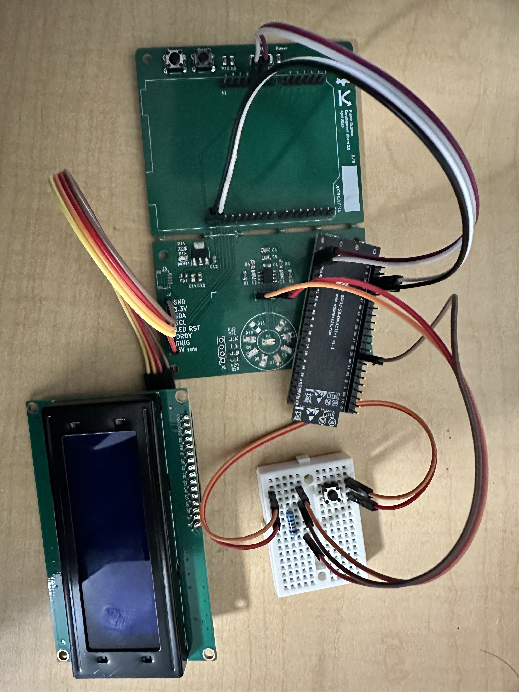
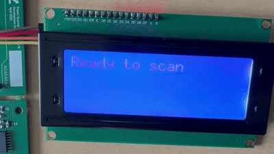

# Plastic Scanner (Capstone Project)

This project was developed using the ESP-IDF framework for the ESP32 microcontroller as part of a senior capstone project.  
The system identifies and classifies different types of plastic using reflectivity data collected from multiple LEDs and sensors.

## Overview

The ESP32 acts as the main controller for a custom board built around several hardware components:

- TLC59208 – controls 6–7 LEDs that illuminate the plastic sample sequentially.
- NAU7802 – captures reflectivity data from a light sensor for each LED cycle.
- Trigger Button – initiates the scanning process when pressed.
- LED Screen – shows the classification result.
- BLE Module – transmits the scan result to a connected mobile app.

When the trigger is pressed, each LED turns on in sequence. The light sensor measures the reflected intensity, which is digitized and passed to an onboard neural network classifier. The classifier determines the plastic type, and the result is displayed locally on the screen and sent via BLE to a connected mobile app.

The prototype demonstrated strong real-world potential leading the client company to later invest over $10,000 in commercial-grade plastic scanners for deployment across multiple facilities.

---

### Tech Stack

- C/C++
- ESP IDF

---

- Real-time reflectivity capture and classification
- Local ML inference on the ESP32
- BLE communication for mobile integration

---

### Note :warning:

This repository includes only the ESP32 firmware and components written by me.  
Other parts of the project (e.g., mobile or desktop apps) are not included here.
You can check out the official capstone website over [capstone.cse.msu.edu/2024-08/projects/gm-ris/](https://capstone.cse.msu.edu/2024-08/projects/gm-ris/)

---

